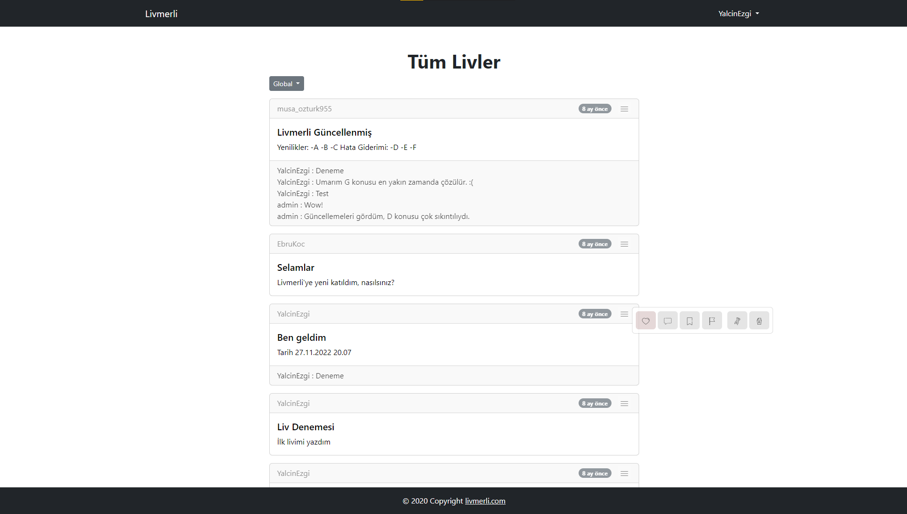
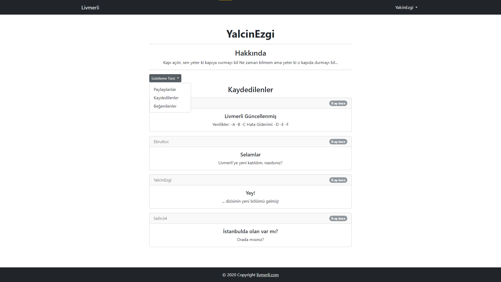
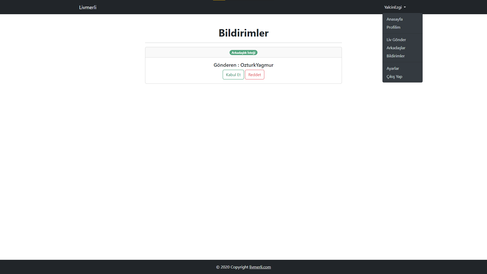
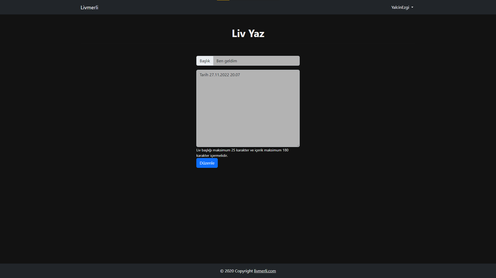

# Livmerli
Livmerli, insanların web üzerinden birbirleriyle etkileşim kurmasını amaçlayan bir platformdur. Livmerli, kullanıcılarına insanların birbirleriyle bağlantı kurmalarını, bilgi paylaşmalarını ve deneyimlerini paylaşmalarını sağlar. Livmerli, kullanıcıların profillerini oluşturmasına olanak tanır ve böylece kullanıcılar kendilerini tanıtabilir, ilgi alanlarını paylaşabilir ve diğer kullanıcılarla ortak noktalar bulabilir. Platform, kullanıcıların mesajlaşma yoluyla birbirleriyle iletişim kurmalarına olanak sağlar, böylece insanlar fikir alışverişinde bulunabilir, tartışmalar yapabilir veya sadece sohbet edebilirler.

### Ana Sayfa

### Profil Sayfası

### Bildirimler Sayfası

### Liv Gönderme Sayfası

# Bilgilendirme
Kendi kendime çalışarak sosyal web sitesinde barınması gereken tüm özellikleri koymaya çalışıyorum. Ayrıntılı bilgi sayfası projenin ilerleyen zamanlarında eklenecektir.

# Durum
- 04.12.2022 | Profil sayfasına beğenilenler, kaydedilenler ve paylaşılanlar kısmı eklendi.
- 03.12.2022 | Kaydedilenler sayfası kaldırıldı.
- 03.12.2022 | Anasayfa ve içerik (liv) sayfasında düzenlemeler yapıldı.
- 03.12.2022 | Yorumlar sayfası içerik (liv) sayfasıyla birleştirildi.
- 02.12.2022 | Anasayfada bulunan beğen, kaydet, yorum yap, şikayet et, düzenle ve sil butonları live girince gözüksün şeklinde değiştirildi.
- 02.12.2022 | Yorumlar sayfasında değişiklikler yapıldı.
- 02.12.2022 | Liv'e yorum ekleme özelliği eklendi.
- 30.11.2022 | Yorumlar sayfası eklendi.
- 30.11.2022 | Gönderiyi kaydetme özelliği ve kaydedilenler sayfası eklendi.
- 28.11.2022 | Sadece arkadaş Livlerini görme eklendi.
- 28.11.2022 | Arkadaşlık isteği gönderme eklendi.
- 28.11.2022 | Profiller arası geçiş özelliği eklendi.
- 28.11.2022 | Projeye başlangıç tarihi.

# Ayrıntı
- PHP 8.1.7
- Bootstrap 5.2.1

# Lisans
Proje [MIT License](./License) altında yayınlanmaktadır.
