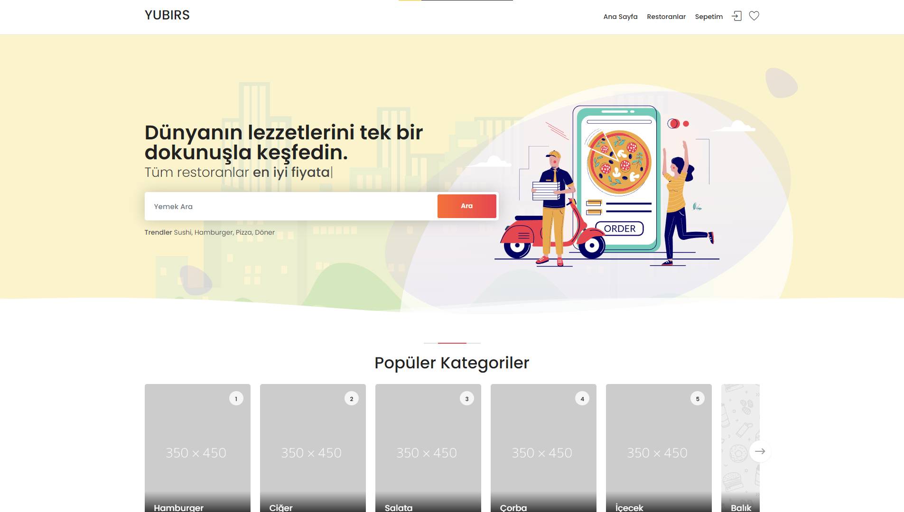
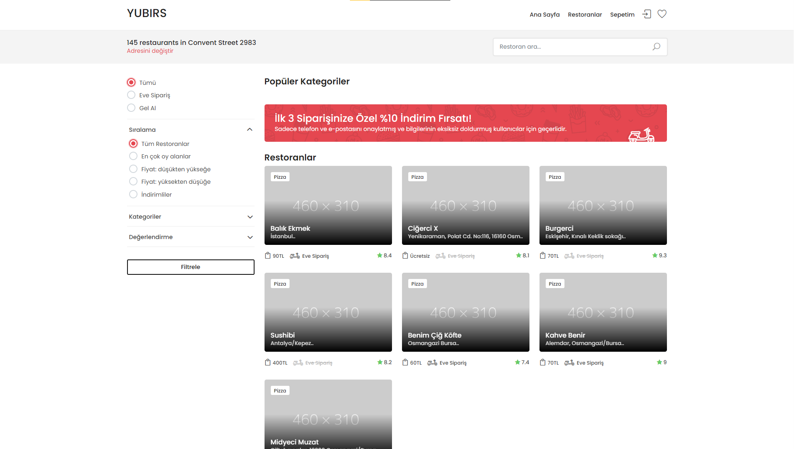
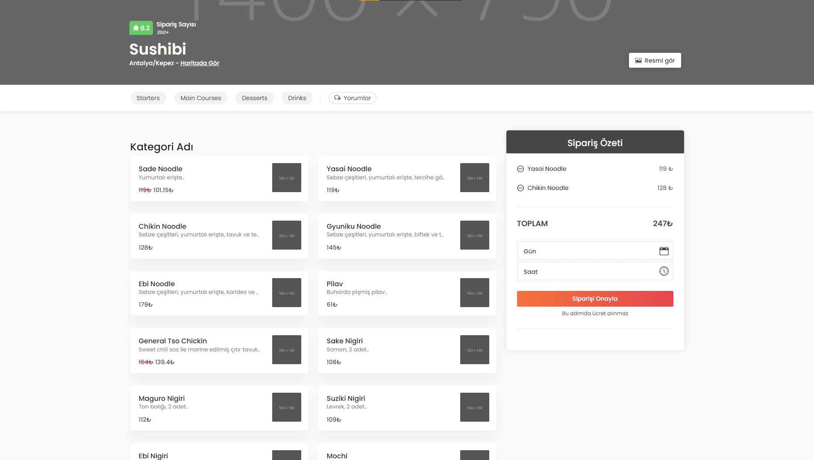
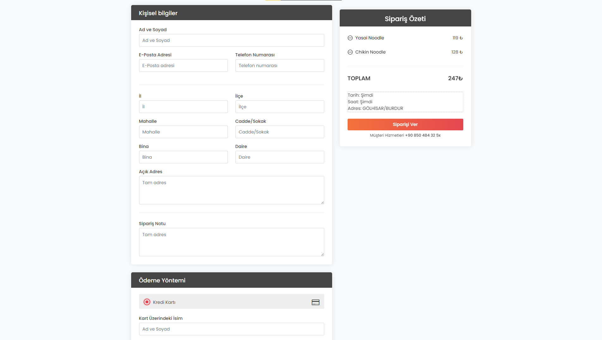
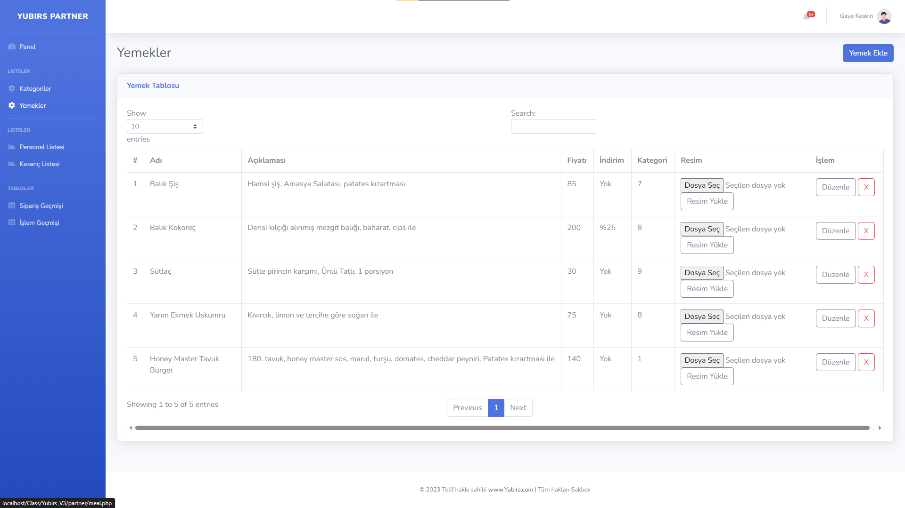
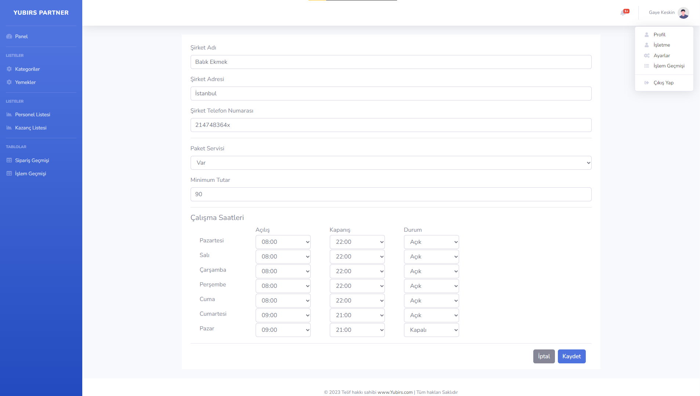

# Livmerli
Livmerli, insanların web üzerinden birbirleriyle etkileşim kurmasını amaçlar.

### Ana Sayfa

### Restoranlar Sayfası

### Restoran Sayfası

### Ödeme Sayfası

### Admin Panel | Yemekler Sayfası

### Admin Panel | İşletme Sayfası

# Bilgilendirme
İlk büyük PHP projem, kendi kendime çalışarak sosyal web sitesinde barınması gereken tüm özellikleri koymaya çalışıyorum. Ayrıntılı bilgi sayfası projenin ilerleyen zamanlarında eklenecektir.

# Durum
- 04.12.2022 | Profil sayfasına beğenilenler, kaydedilenler ve paylaşılanlar kısmı eklendi.
- 03.12.2022 | Kaydedilenler sayfası kaldırıldı.
- 03.12.2022 | Anasayfa ve içerik (liv) sayfasında düzenlemeler yapıldı.
- 03.12.2022 | Yorumlar sayfası içerik (liv) sayfasıyla birleştirildi.
- 02.12.2022 | Anasayfada bulunan beğen, kaydet, yorum yap, şikayet et, düzenle ve sil butonları live girince gözüksün şeklinde değiştirildi.
- 02.12.2022 | Yorumlar sayfasında değişiklikler yapıldı.
- 02.12.2022 | Liv'e yorum ekleme özelliği eklendi.
- 30.11.2022 | Yorumlar sayfası eklendi.
- 30.11.2022 | Gönderiyi kaydetme özelliği ve kaydedilenler sayfası eklendi.
- 28.11.2022 | Sadece arkadaş Livlerini görme eklendi.
- 28.11.2022 | Arkadaşlık isteği gönderme eklendi.
- 28.11.2022 | Profiller arası geçiş özelliği eklendi.
- XX.11.2022 | Projeye başlangıç tarihi.

# Ayrıntı
- PHP 8.1.7
- Bootstrap 5.2.1

# Not
Frontendin büyük kısmı hazır alınmıştır.

# Lisans
Proje [MIT License](./License) altında yayınlanmaktadır.
